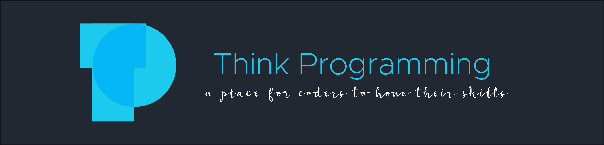

<h1 align="center"></h1>

      

<h3 align="center">
	A Place for coders to hone their skills
</h3>

	<strong>
		<a href="https://github.com/thinkful-ei23/think-programming-server" target="_blank">GitHub Server</a>
		•
		<a href="https://think-programming-client.herokuapp.com/" target="_blank">Demo Here</a>
    </strong>

## What Are We
A spot to challenge another coding enthusiest in a language or programing category to come up with the fastest and cleanest correct code.  When two players are ready, a question appears and a text area becomes activated allowing you to type your answer.  But watch out becuase you can see each others code as it being written!  

When done click finish to lock the challengers text area and make them check your code and approve or deny their answer!  Think Programming can improve your muscle memory of fundemential coding.    

## Tech Used

### Front-End
* React
* Redux
* Redux-Router
* Redux-Form
* Redux-Thunk
* Socket.io
* Ace Editor
* Enzyme
* JavaScript
* HTML5
* CSS3

### Back-End
* Node.js
* Express.js
* Mongoose
* mLab
* Passport
* Bcryptjs
* JWT
* Socket.io

### Deployment
* Github
* TravisCI
* Heroku

### Developers

|  |  |  |  |
| :----: | :----: | :----: | :----: |
| [Timothy Dao](https://github.com/JacobMacInnis) | [Jacob MacInnis](https://github.com/JacobMacInnis) | [Jeff Maxwell](https://github.com/maxjeffwell) | [Jon Sung](https://github.com/jonsung89) |
